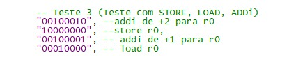
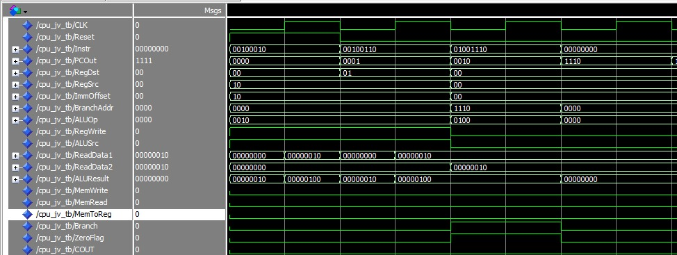
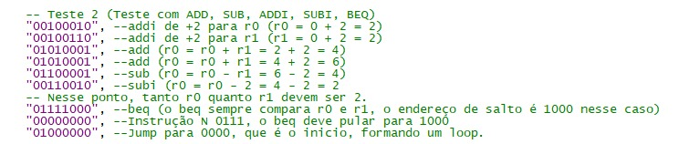
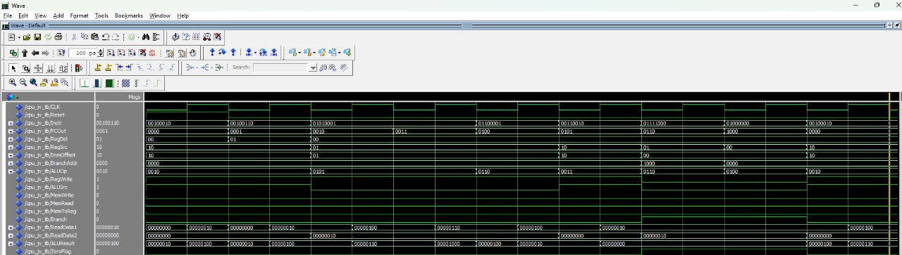

# Teste 1

Resultado = OK!!!! (SIMULE LOCALMENTE PARA MAIS DETALHE NAS WAVEFORMS!!!!)

## Descrição dos Sinais

- **Instr**: Instrução recebida no momento.
- **PCOut**: Posição da instrução lida na ROM.
- **RegDst**: Registrador de destino (00 - r0, 01 - r1, 10 - r2, 11 - r3).
- **RegSrc**: Registrador de origem (00 - r0, 01 - r1, 10 - r2, 11 - r3).
- **ImmOffset**: Offset para instruções ADDi, SUBi, LOAD e STORE. O campo `ImmOffset` passa pelo extensor 2x8 para a ALU.
- **ALUOP**: Código da operação na ALU.
- **ReadData 1**: Registrador lido no espaço 1 (Selecionado por `RegDst`).
- **ReadData 2**: Registrador lido no espaço 2 (Selecionado por `RegSrc`).
- **ALUResult**: Resultado da ALU no instante. **Importante**: A ALU tem funcionamento assíncrono devido a problemas encontrados ao utilizá-la com a borda de subida. Os registradores são atualizados na borda de subida, pegando o último valor encontrado na ALU na borda de descida. Portanto, qualquer valor em `ALUResult` na subida deve ser ignorado, pois não influencia em nada.

---

## Descrição do Teste

### Momento 1: "00100010" (addi de +2 para r0)

- **Intervalo**: 0 a 10 ns
- Na borda baixa, o PC recebe o endereço da instrução a ser lida e decodificada.
    - **Opcode**: 0010
    - **Registrador Destino**: 00 (r0)
    - **Imediato**: 10 (2)
    - **ReadData 1 (r0)**: 00000000
    - **ALUResult (borda baixa)**: 00000010
- Na borda alta, o valor lido em `ReadData 1` (r0) é atualizado para 2, pegando o `ALUResult` da borda baixa como resultado a ser escrito.

**Comentário**:  
Na borda baixa, o PC recebe o endereço da instrução a ser lido e decodificado.

---

### Momento 2: "00100110" (addi de +2 para r1)

- **Intervalo**: 11 a 20 ns
- Na borda baixa, o PC recebe o endereço da instrução a ser lida e decodificada.
    - **Opcode**: 0010
    - **Registrador Destino**: 01 (r1)
    - **Imediato**: 10 (2)
    - **ReadData 1 (r1)**: 00000000
    - **ALUResult (borda baixa)**: 00000010
- Na borda alta, o valor lido em `ReadData 1` (r1) é atualizado para 2, pegando o `ALUResult` da borda baixa como resultado a ser escrito.

---

### Momento 3: "01001110" (Jump para 1110)

- **Intervalo**: 81 a 90 ns
    - **Opcode**: 0111
    - **Endereço de Jump**: 0000
    - **Branch**: 1
    - **ZeroFlag**: 1 (Não depende de subtrações)
    - **ALUResult (borda baixa)**: U (A ALU não realiza cálculo em casos de Jump, apenas ativa a `ZeroFlag` e o salto ocorre)

**Comentário**:  
A ALU não realiza nenhum cálculo em casos de Jump, só ativa a ZeroFlag e o salto ocorre.

---	  
# Teste 2

Resultado = OK!!! (SIMULE LOCALMENTE PARA MAIS DETALHE NAS WAVEFORMS!!!!)

## Descrição dos Sinais

- **Instr**: Instrução recebida no momento.
- **PCOut**: Posição da instrução lida na ROM.
- **RegDst**: Registrador de destino (00 - r0, 01 - r1, 10 - r2, 11 - r3).
- **RegSrc**: Registrador de origem (00 - r0, 01 - r1, 10 - r2, 11 - r3).
- **ImmOffset**: Offset para instruções ADDi, SUBi, LOAD e STORE. O campo `ImmOffset` passa pelo extensor 2x8 para a ALU.
- **ALUOP**: Código da operação na ALU.
- **ReadData 1**: Registrador lido no espaço 1 (Selecionado por `RegDst`).
- **ReadData 2**: Registrador lido no espaço 2 (Selecionado por `RegSrc`).
- **ALUResult**: Resultado da ALU no instante. **Importante**: A ALU tem funcionamento assíncrono devido a problemas encontrados ao utilizá-la com a borda de subida. Os registradores são atualizados na borda de subida, pegando o último valor encontrado na ALU na borda de descida. Portanto, qualquer valor em `ALUResult` na subida deve ser ignorado, pois não influencia em nada.

---

## Descrição do Teste

### Momento 1: "00100010" (addi de +2 para r0)

- **Intervalo**: 0 a 10 ns
- Na borda baixa, o PC recebe o endereço da instrução a ser lida e decodificada.
    - **Opcode**: 0010
    - **Registrador Destino**: 00 (r0)
    - **Imediato**: 10 (2)
    - **ReadData 1 (r0)**: 00000000
    - **ALUResult (borda baixa)**: 00000010
- Na borda alta, o valor lido em `ReadData 1` (r0) é atualizado para 2, pegando o `ALUResult` da borda baixa como resultado a ser escrito.

**Comentário**:  
Na borda baixa, o PC recebe o endereço da instrução a ser lido e decodificado.

---

### Momento 2: "00100110" (addi de +2 para r1)

- **Intervalo**: 11 a 20 ns
- Na borda baixa, o PC recebe o endereço da instrução a ser lida e decodificada.
    - **Opcode**: 0010
    - **Registrador Destino**: 01 (r1)
    - **Imediato**: 10 (2)
    - **ReadData 1 (r1)**: 00000000
    - **ALUResult (borda baixa)**: 00000010
- Na borda alta, o valor lido em `ReadData 1` (r1) é atualizado para 2, pegando o `ALUResult` da borda baixa como resultado a ser escrito.

---

### Momento 3: "01010001" (add: r0 = r0 + r1 = 2 + 2 = 4)

- **Intervalo**: 21 a 30 ns
- Na borda baixa, o PC recebe o endereço da instrução a ser lida e decodificada.
    - **Opcode**: 0101
    - **Registrador Destino**: 00 (r0)
    - **Registrador Origem**: 01 (r1)
    - **ReadData 1 (r0)**: 00000010
    - **ReadData 2 (r1)**: 00000010
    - **ALUResult (borda baixa)**: 00000100
- Na borda alta, o valor lido em `ReadData 1` (r0) é atualizado para 4, pegando o `ALUResult` da borda baixa como resultado a ser escrito.

---

### Momento 4: "01010001" (add: r0 = r0 + r1 = 4 + 2 = 6)

- **Intervalo**: 31 a 40 ns
- Na borda baixa, o PC recebe o endereço da instrução a ser lida e decodificada.
    - **Opcode**: 0101
    - **Registrador Destino**: 00 (r0)
    - **Registrador Origem**: 01 (r1)
    - **ReadData 1 (r0)**: 00000100
    - **ReadData 2 (r1)**: 00000010
    - **ALUResult (borda baixa)**: 00000110
- Na borda alta, o valor lido em `ReadData 1` (r0) é atualizado para 6, pegando o `ALUResult` da borda baixa como resultado a ser escrito.

---

### Momento 5: "01100001" (sub: r0 = r0 - r1 = 6 - 2 = 4)

- **Intervalo**: 41 a 50 ns
- Na borda baixa, o PC recebe o endereço da instrução a ser lida e decodificada.
    - **Opcode**: 0110
    - **Registrador Destino**: 00 (r0)
    - **Registrador Origem**: 01 (r1)
    - **ReadData 1 (r0)**: 00000110
    - **ReadData 2 (r1)**: 00000010
    - **ALUResult (borda baixa)**: 00000100
- Na borda alta, o valor lido em `ReadData 1` (r0) é atualizado para 4, pegando o `ALUResult` da borda baixa como resultado a ser escrito.

---

### Momento 6: "00110010" (subi: r0 = r0 - 2 = 4 - 2 = 2)

- **Intervalo**: 51 a 60 ns
- Na borda baixa, o PC recebe o endereço da instrução a ser lida e decodificada.
    - **Opcode**: 0011
    - **Registrador Destino**: 00 (r0)
    - **ReadData 1 (r0)**: 00000100
    - **ReadData 2 (r1)**: 00000010
    - **ALUResult (borda baixa)**: 00000010
- Na borda alta, o valor lido em `ReadData 1` (r0) é atualizado para 2, pegando o `ALUResult` da borda baixa como resultado a ser escrito.

---

### Momento 7: "01111000" (beq: compara r0 e r1, salto para 1000)

- **Intervalo**: 61 a 70 ns
- Na borda baixa, o PC recebe o endereço da instrução a ser lida e decodificada.
    - **Opcode**: 0111
    - **Endereço de Branch**: 1000
    - **Branch**: 1
    - **ZeroFlag**: 1 (A subtração na ALU deu zero)
    - **ALUResult (borda baixa)**: 00000000
- O `beq` ocorre, pois a `ZeroFlag` está ativada, fazendo o salto para o endereço 1000.

---

### Momento 8: "00000000" (Instrução N 0111, o beq deve pular para 1000)

- **Intervalo**: 71 a 80 ns
- A instrução foi devidamente pulada graças ao `BEQ`.

**Comentário**:  
A instrução foi devidamente pulada graças ao BEQ.

---

### Momento 9: "01000000" (Jump para 0000, início do loop)

- **Intervalo**: 81 a 90 ns
    - **Opcode**: 0100
    - **Endereço de Jump**: 0000
    - **Branch**: 1
    - **ZeroFlag**: 1 (Não depende de subtrações)
    - **ALUResult (borda baixa)**: U (A ALU não realiza cálculo em casos de Jump, apenas ativa a `ZeroFlag` e o salto ocorre)

**Comentário**:  
A ALU não realiza nenhum cálculo em casos de Jump, só ativa a ZeroFlag e o salto ocorre.

---
